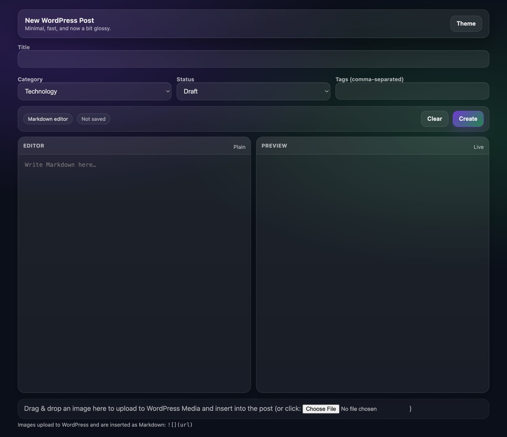

# post-app

A tiny local web app for creating WordPress posts (draft or publish) via the WordPress REST API.

- **Fast:** one page, minimal UI
- **Safe by default:** binds to `127.0.0.1` unless you change it
- **Markdown → HTML:** write Markdown, preview live, publish to WordPress
- **Image upload:** drag & drop images → uploads to WP Media → inserts `` into the body

## Screenshot



## How it works

This is a small Express server that:
- serves a simple HTML form UI
- uploads images to WordPress via `POST /wp-json/wp/v2/media`
- creates posts via `POST /wp-json/wp/v2/posts`

## Quick start

```bash
cd wp-post-form
npm install
cp .env.example .env
npm start
```

Open:
- http://127.0.0.1:8787

## Configuration

Edit `wp-post-form/.env`:

- `WP_BASE_URL` – e.g. `https://example.com`
- `WP_USERNAME` – your WP username/email
- `WP_APP_PASSWORD` – WordPress *Application Password*
- `BIND_HOST` – defaults to `127.0.0.1` (local only)
- `PORT` – defaults to `8787`
- `ACCESS_TOKEN` – optional shared secret; send as `X-Access-Token` header or `?token=` query

## Phone access (recommended: Tailscale)

1. Install Tailscale on your Mac + phone
2. Set `BIND_HOST` to your Mac’s **Tailscale IP** (preferred) or `0.0.0.0`
3. Open on your phone: `http://<mac-tailscale-ip>:8787`

## Notes

- Category IDs are configured in `wp-post-form/config.js`.
- This repo intentionally does **not** commit `.env`.
